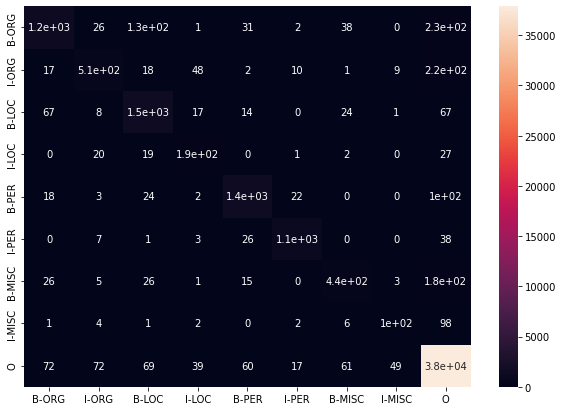

### Performance
The BiLSTM achieves F1 score macro of 78.34 on the CoNLL 2003 test dataset with the following hyperparameters:
* learning rate: 2e-05
* batch size: 1 (1 sentence)
* cross entropy loss
* adam optimizer
* num layers: 1
* hidden dim: 100 
* glove 50d word embeddings

This model can be retrieved at model_file/model_with_f1.ckpt


__Classification matrix__

       precision    recall  f1-score   support

       B-ORG       0.86      0.72      0.78      1661
       I-ORG       0.78      0.61      0.68       835
       B-LOC       0.84      0.88      0.86      1668
       I-LOC       0.62      0.73      0.67       257
       B-PER       0.91      0.89      0.90      1617
       I-PER       0.95      0.94      0.94      1156
      B-MISC       0.77      0.63      0.69       702
      I-MISC       0.62      0.47      0.54       216
           O       0.97      0.99      0.98     38323

     accuracy                           0.95     46435
    macro avg       0.81      0.76      0.78     46435
    weighted avg    0.95      0.95      0.95     46435

__F1_score on the validation dataset__  
Epoch: 0  65.9%  
Epoch: 1  73.4%  
Epoch: 2  76.9%  
Epoch: 3  0.79.3%   
Epoch: 4  80.9%  
Epoch: 5  82.2%  
Epoch: 6  83.3%  
Epoch: 7  84.1%  
Epoch: 8  84.7%  
Epoch: 9  85.4%  
Epoch: 10  85.7%  
Epoch: 11  85.9%  
Epoch: 12  86.2%  
Epoch: 13  86.5%  
Epoch: 14  86.6%  
Epoch: 15  87.0%  
Epoch: 16  87.3%  
Epoch: 17  87.4%  
Epoch: 18  87.7%  
Epoch: 19  87.8%  

__Heatmap__



### Installation
Python 3.7 and Pytorch 1.8.1. Its dependencies are summarized in the file requirements.txt

### Code reference
* model.py: define the BiLSTM model class.  
* train.py: define the training routines.  
* inference.py: define the routine for tests.  
* preprocessing.py: contains functions to prepare the train/val/test data  
* evaluation.py: contains functions to calculate the evaluat ion metrics  
* visualisation.ipynb: jupyter notebook to that run the end-to-end train and test routine including the classification report and the f1_score macro for each of the 20 epochs.
* model_files/: directory to save the model checkpoint files 
* data/: contains the train/val/test dataset and the pretrained word embeddings. 

### Word embeddings
The Glove word embeddings is downloaded from https://nextcloud.ukp.informatik.tu-darmstadt.de/index.php/s/g6xfciqqQbw99Xw

### Usage: 
* Please download the glove embeddings into the following folder data/glove.6B.50d
* Train:  default hyperparameters are set in ``` train.sh```. Run command ```sh train.sh``` to start the training on the train and the test daset.
* Test: default hyperparameters are set in ``` inference.sh```. Run command ```sh inference.sh``` to perform the inference and evaluation of the model on the test dataset.